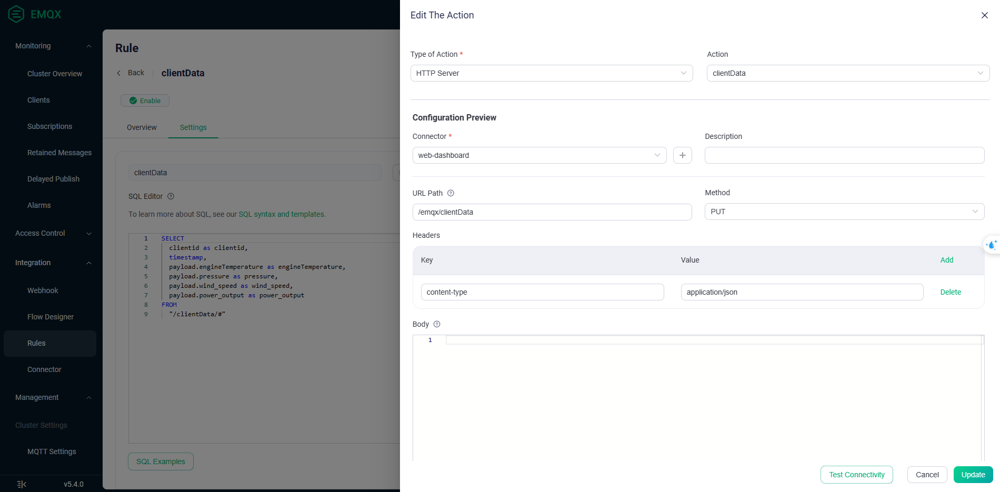

# FunChat App

:heart: A product that implements MQTT protocol applications based on EMQX and Webserver :heart:

## Directory structure:

- dataSrc: Simulate data source for up to 1000 clients using Nodejs
- webserver: Dashboard website (frontend + backend)

## Getting Started

- Install and Configure EMQX
- git clone https://github.com/ngoxuansy30082002/MQTT_EMQX.git
- open terminal
- cd MQTT_EMQX/webserver
- npm install
- npm run watch
- Ctrl + S at SCSS files
- npm start
- run localhost:8080
- cd MQTT_EMQX/dataSrc
- npm install
- node index

## Authentication used in emqx dashboard

- username: admin
- password: public

## Authentication used in web dashboard

- Username/Email/Password
- JWT

# Configure EMQX

